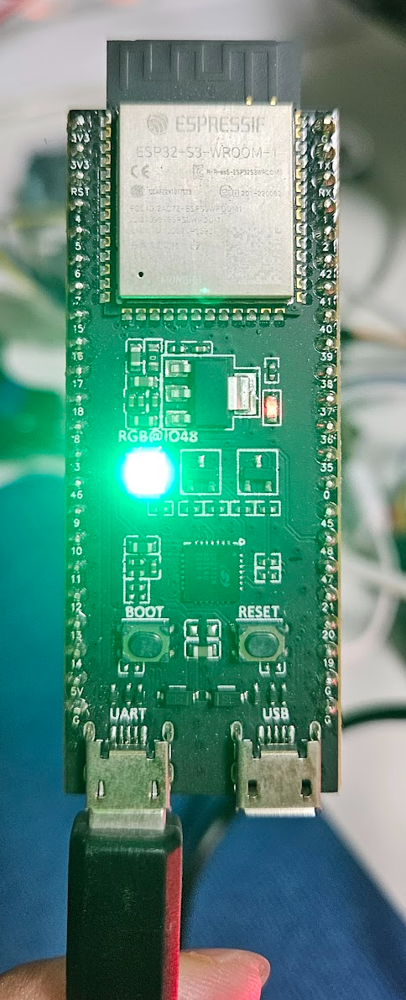
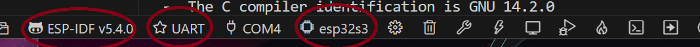
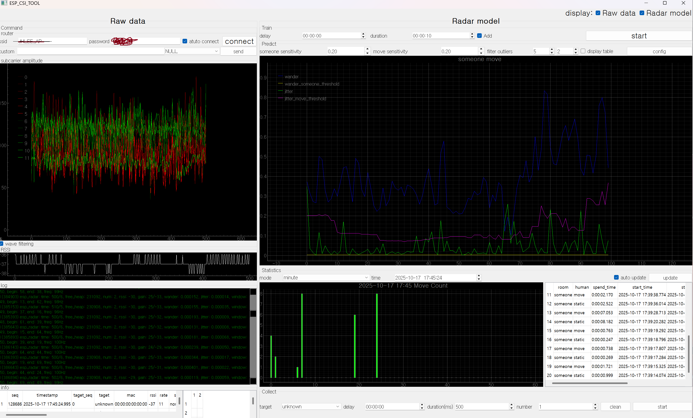

# SETUP VSCODE 

<br/>

* TEST Board and Envs 
    * ESP-IDF:5.4.0
    * UART (left) not USB 
    * ESP32-S3-DevKitC-1        

<br/>



<br/>


## SETUP VSCODE Setup  in Window 

<br/>

* Please check your setting.json if you use VSCode based ESP-IDF in Window

<br/>

.vscode/settings.json 
```
  "idf.openOcdConfigs": [
    "interface/ftdi/esp32_devkitj_v1.cfg",
    "target/esp32s3.cfg"
  ],

  "idf.portWin": "COM4",
  "idf.customExtraVars": {
    "OPENOCD_SCRIPTS": "----(PATH based on Window Your profile)\.espressif\\tools\\openocd-esp32\{xxxxxx}",
    "IDF_CCACHE_ENABLE": "1",
    "ESP_ROM_ELF_DIR": "----(PATH based on Window Your profile)\.espressif\\tools\\esp-rom-elfs\{xxxxxx}",
    "IDF_TARGET": "esp32s3"
  },
```

<br/>



<br/>

## Setup Build/Monitor in VSCODE 

<br/>

have to use ESP-IDF Termianl , not used Power Shell 


* Build Radar Setup 

```ESP-IDF Terminal in Window   
cd examples\esp-radar\console_test
esp-csi\examples\esp-radar\console_test> idf.py --version                # Check ESP-IDF Version 
esp-csi\examples\esp-radar\console_test> idf.py set-target esp32s3       # Setup your CPU  

```

<br/>

* Please check your CPU in sdkconfig 
```ESP-IDF Terminal in Window
esp-csi\examples\esp-radar\console_test> idf.py menuconfig               # make sdkconfig based on sdkconfig.defaults and IDF_TARGET in your json 
```

<br/>

*  Build 
```ESP-IDF Terminal in Window

esp-csi\examples\esp-radar\console_test> idf.py build
esp-csi\examples\esp-radar\console_test> idf.py -p COM4 flash -b 921600 # Serial COM4 
esp-csi\examples\esp-radar\console_test> idf.py -p COM4 monitor      # Serial COM4 
```

<br/>

* Option-Project Fullclean or clean 
```ESP-IDF Terminal in Window
esp-csi\examples\esp-radar\console_test> idf.py fullclean # remove all build 
esp-csi\examples\esp-radar\console_test> idf.py clean     # remove build 
```

* Option-Flash (other, Not Recommend)
```ESP-IDF Terminal in Window
esp-csi\examples\esp-radar\console_test> esptool.py --chip esp32s3 -p COM4 -b 460800 --before=default_reset --after=hard_reset write_flash --flash_mode dio --flash_freq 80m --flash_size 4MB 0x1000 ./build/bootloader/bootloader.bin 0x20000 ./build/console_test.bin 0x8000 ./build/partition_table/partition-table.bin 0x1d000 ./build/ota_data_initial.bin
```

<br/>

* Check Working 
```
esp-csi\examples\esp-radar\console_test> idf.py -p COM4 monitor
```


## Test Python in VSCODE 

<br/>

This test program communicates with the ESP32-S via a serial connection.

```
cd examples\esp-radar\console_test\tools
esp-csi\examples\esp-radar\console_test\tools> python ./esp_csi_tool.py -p COM4
```

* SETUP  
    * WIFI AP SSID and PW Setup and Connect 
